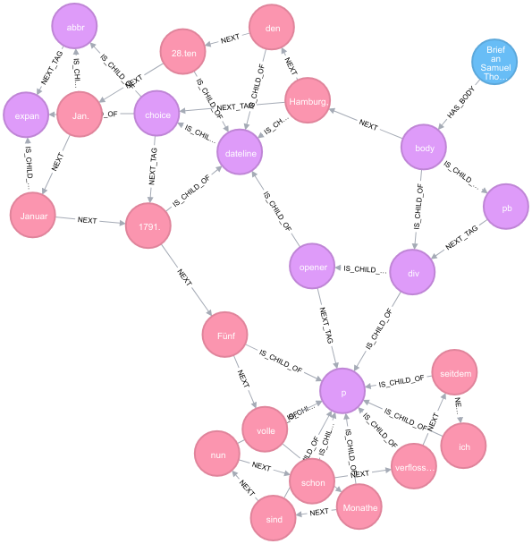

## *WARNING: there's a generic XML in the APOC library, see https://neo4j.com/docs/labs/apoc/current/import/xml/#load-xml-available-procedures-apoc.import.xml*

# neo4j-tei-importer

image::https://travis-ci.org/sarmbruster/neo4j-tei-importer.svg?branch=master[alt="Travis CI Status", link="https://travis-ci.org/sarmbruster/neo4j-tei-importer"]

neo4j-tei-importer imports data from XML files using the http://www.tei-c.org[TEI] schema to a Neo4j database.

## Installation

This project uses http://www.gradle.org[gradle] as build system. Since the gradle wrapper in included, there is no need to download anything beforehand.

To build the project just type:

    ./gradlew shadowJar

Copy (or symlink) the resulting file `./build/libs/neo4j-tei-importer-0.1-SNAPSHOT-all.jar` to Neo4j's `plugins` folder.

If you want to use the "old" REST endpoints in contrast to Cypher stored procedure, change configuration in `$NEO4J/conf/neo4j.conf`:

    dbms.unmanaged_extension_classes=org.neo4j.extension.adwmainz.tei=/tei

After a restart using `$NEO4J_HOME/bin/neo4j restart` the extension is ready to use.

## Usage

### TEI

For an example of a imported XML TEI document refer to the following screenshot

#### import a TEI XML document via Cypher stored procedure

The preferred option for importing is calling a Cypher stored procedure. A URL to the XML document to be imported needs to be provided as parameter - could be either `file`, `http`, `https` or `ftp:`.
The procedure returns the node representing the document in the graph.

Example:
----
CALL tei.import('file:///var/lib/neo4j/import/humboldt_soemmering01_1791.TEI-P5 (1).xml') yield node return node
----

#### upload local XML document via HTTP PUT

Using REST a XML TEI file can be imported by simple sending an HTTP PUT to REST endpoint http://host:7474/tei/import. E.g. via cURL:

----
curl [-u neo4j:<mypasswd>] -T src/test/resources/1667-09-23_Langius_a_Lubienietzki-mit-Regest-ohne-Kommentar.xml http://localhost:7474/tei/import
----

#### submit XML document via URL

Additionally it's possible to omit the payload in the PUT request and specify the URL location of the document via
url request parameter. Be aware to supply the url in urlencoded variant:

----
curl [-u neo4j:<mypasswd>] -X PUT http://localhost:7474/tei/import?url=http%3A%2F%2Fmyhost%2Fabc.xml
----

#### useful cypher queries on TEI data

get back the original text contained in the document::
`match (s:Source)-[:HAS_BODY]->(b), p=(b)-[:NEXT*]->(e)
 where not (e)-[:NEXT*]->()
 return apoc.text.join([x in nodes(p) where x:Word | x.text], " ") as text`

### windeck data

There's a stored procedure to import windeck files:

----
call adwmainz.windeck("file:///var/lib/neo4j/import/windeck_graf.utf8", 12344)
----

Second parameter is the word offset number.
